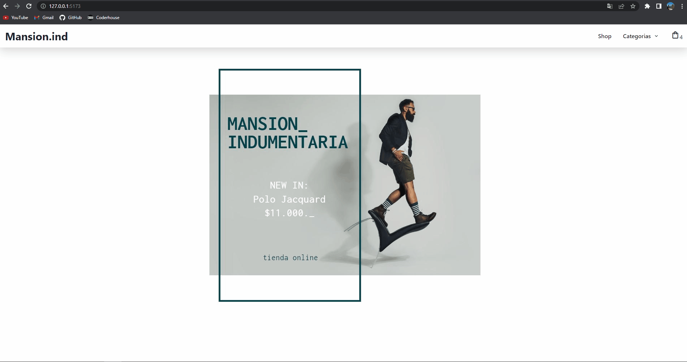

# Mansion.ind

---

**Descripcion:**

El proyecto se trata de un E-commerce, tienda de ropa, realizado con ReactJS, en el cual se pueden ver los productos que vienen de una base de datos, filtrar por categoría, agregar al carrito la cantidad deseada y, luego de completar el formulario, poder realizar la compra la cual se guardara como una nueva orden en Firebase.

**Herramientas utilizadas:**

- ReactJS
- Visual Studio Code
- Vite.js
- Chakra UI
- React Router Dom
- Firebase

---

